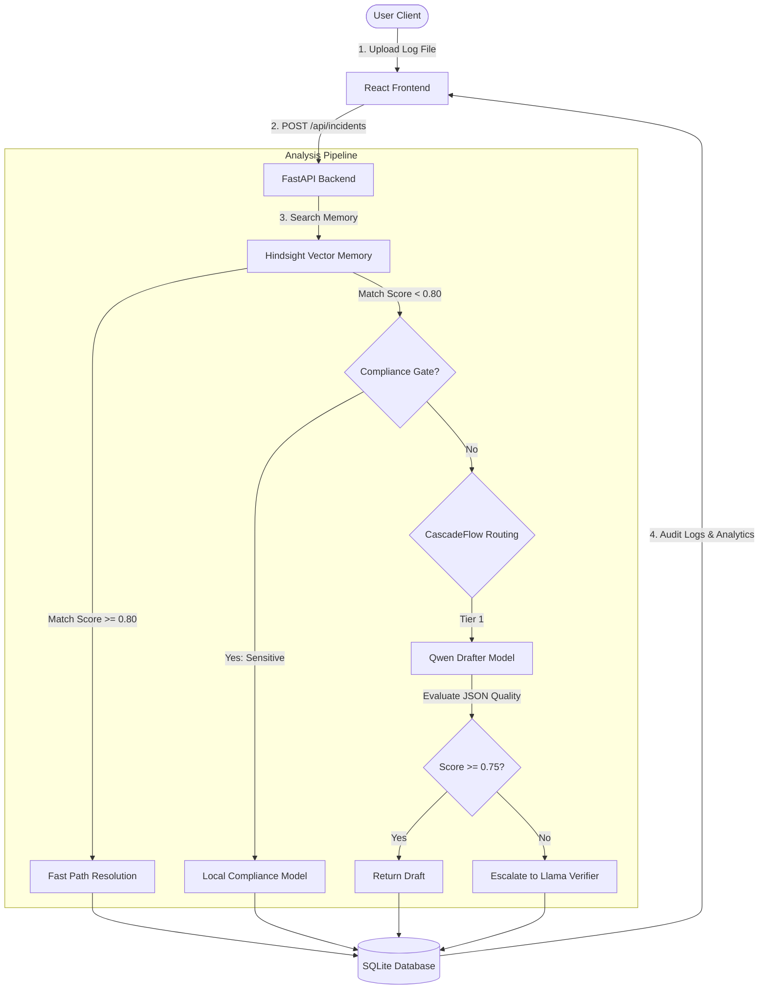
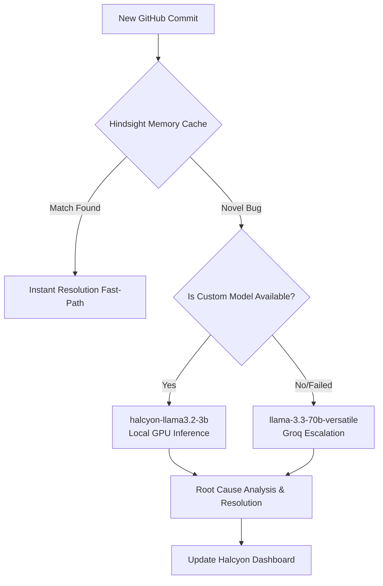
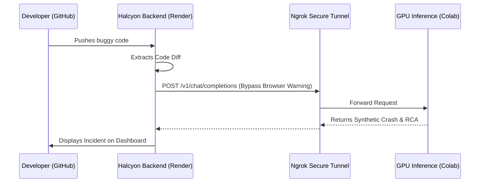

# Halcyon — Intelligent Log Analytics & Resolution Gateway


<p align="center">
  
  
  
</p>

---

## 🌌 Overview

**Halcyon** is a production-ready, high-fidelity log analysis dashboard and AI orchestration platform. It is engineered to help engineering teams parse, structure, and diagnose server outages with maximum cost-efficiency and absolute speed. 

Through its custom frontend motion graphics, users are greeted with a beautiful, real-time diagnostic oscilloscope simulating the stability profile of their system—translating raw console chaos into structural serenity.

### 🌟 Core Value Propositions
* **Interactive Waveform Analytics**: An HTML5 Canvas-based oscilloscope rendering real-time stability waves based on diagnostic incident logs (calming as anomalies get resolved).
* **CascadeFlow Intelligence Routing**: Smart cost optimization utilizing lightweight models (`qwen/qwen3-32b`) as drafters, scoring quality, and conditionally escalating to heavyweight verifiers (`llama-3.3-70b`) only when necessary (saves up to 90% inference cost).
* **Hindsight Semantic Memory**: Integrates Vectorize Hindsight to instantly recall solutions to previously resolved outages, reducing resolution latency to under 100ms.
* **Sensitive Compliance Gating**: Automatically intercepts and routes log lines containing PII or proprietary credentials to compliance-secure local infrastructure.

---

## 🖼️ Motion Graphics & Premium UX

Halcyon sets a new standard for developer tool aesthetics. By combining smooth physics, interactive canvases, and atmospheric glows, the interface is both highly functional and visually stunning.

### 1. HTML5 Canvas Diagnostic Waveform
The central hero of the landing screen and dashboard headers, the Oscilloscope Waveform ([Waveform.jsx](file:///c:/Users/priya/Desktop/Hackathon/Halcyon/frontend/src/components/Waveform.jsx)) synthesizes layered sine waves directly via the Canvas API.
* **Dynamic Physics (LERP)**: Transitions between states (`calm` and `chaotic`) smoothly interpolate amplitude, frequency, and speed values over time using Linear Interpolation.
* **Organic Noise Injection**: In the `chaotic` state, the wave simulates real jitter by injecting pseudo-random noise layers generated using time-varying cosine and sine wave offsets.
* **Device Pixel Ratio (DPR) Scaling**: The rendering loop scales dynamically to ensure crisp, razor-sharp lines on Retina and high-DPI displays.
* **Low-Power Mode**: Native integration with the browser's `prefers-reduced-motion` media query to stop animations and save power when requested by the OS.

### 2. Atmospheric Ambient Light Meshes
Inspired by luxury UI designs, Halcyon features floating atmospheric meshes in the background. Powered by `framer-motion`, these meshes drift slowly and change size organically, establishing a soothing, modern dark-mode gradient.

### 3. State-Driven Micro-Animations
The dashboard reacts to user behavior. Status changes, file uploads, and diagnostic cards utilize smooth transitions, scale triggers, and glowing border highlights to provide instant, satisfying visual feedback.

---

## 📐 System Architecture

The following diagram illustrates how log data flows through Halcyon's multi-tiered resolution pipeline:



---

## 📁 Repository Structure

### Backend (`/backend`)
* [app.py](file:///c:/Users/priya/Desktop/Hackathon/Halcyon/backend/app.py): Main entry point configuring CORS, Lifespan, and Global Error Handling.
* [routes.py](file:///c:/Users/priya/Desktop/Hackathon/Halcyon/backend/routes.py): Complete REST endpoints supporting CRUD, history search, and statistics.
* [ai.py](file:///c:/Users/priya/Desktop/Hackathon/Halcyon/backend/ai.py): Orchestrates the AI analysis pipeline including compliance gates and known pattern matchers.
* [cascadeflow.py](file:///c:/Users/priya/Desktop/Hackathon/Halcyon/backend/cascadeflow.py): Quality-scoring engine routing requests between draft and verify model tiers.
* [memory.py](file:///c:/Users/priya/Desktop/Hackathon/Halcyon/backend/memory.py): Interface for Hindsight semantic recall and retention.
* [database.py](file:///c:/Users/priya/Desktop/Hackathon/Halcyon/backend/database.py): SQLAlchemy models for incidents, tags, similar incident links, and routing audit logs.

### Frontend (`/frontend`)
* [src/App.jsx](file:///c:/Users/priya/Desktop/Hackathon/Halcyon/frontend/src/App.jsx): Sets up state routing using Wouter and injects the global oscilloscope state.
* [src/components/LandingPage.jsx](file:///c:/Users/priya/Desktop/Hackathon/Halcyon/frontend/src/components/LandingPage.jsx): Premium landing experience showcasing animated meshes, FAQs, before/after consoles, and localized translations.
* [src/components/Waveform.jsx](file:///c:/Users/priya/Desktop/Hackathon/Halcyon/frontend/src/components/Waveform.jsx): Mathematical Canvas rendering pipeline creating the signature Halcyon wave motion graphics.
* [src/components/Dashboard.jsx](file:///c:/Users/priya/Desktop/Hackathon/Halcyon/frontend/src/components/Dashboard.jsx): Grid layout detailing aggregate statistics, severity splits, and real-time incident updates.
* [src/components/AuditView.jsx](file:///c:/Users/priya/Desktop/Hackathon/Halcyon/frontend/src/components/AuditView.jsx): Comprehensive audit logs visualizing cost, latency, and Model Routing details.

---

## 🚀 Quick Start

Ensure you have Python 3.10+ and Node.js 18+ installed on your system.

### 1. Set Up the Backend
1. Navigate to the backend folder:
   ```bash
   cd backend
   ```
2. Create a virtual environment and install requirements:
   ```bash
   python -m venv .venv
   # Windows:
   .venv\Scripts\activate
   # macOS/Linux:
   source .venv/bin/activate

   pip install -r requirements.txt
   ```
3. Create your local configuration file:
   ```bash
   cp .env.example .env
   ```
   *Modify `.env` to include your credentials (minimum `GROQ_API_KEY`).*
4. Run the FastAPI server:
   ```bash
   uvicorn app:app --reload
   ```
   The backend API will run at `http://127.0.0.1:8000`. You can inspect documentation at `http://127.0.0.1:8000/docs`.

---

### 2. Set Up the Frontend
1. Open a new terminal and navigate to the frontend folder:
   ```bash
   cd frontend
   ```
2. Install npm dependencies:
   ```bash
   npm install
   ```
3. Start the Vite dev server:
   ```bash
   npm run dev
   ```
   The frontend app will launch at `http://localhost:5173`. Click the **Enter Dashboard &rarr;** button to transition from the interactive hero animation to the live monitoring panel.

---

### 3. Set Up the Fine-Tuned Model (Cloud)
To use the custom fine-tuned LLaMA model on a free Google Colab instance, follow these steps:
1. Open the included `Halcyon_Cloud_Server.ipynb` file in Google Colab.
2. The notebook already contains your Ngrok token. Go to **Runtime > Change runtime type** and ensure you're using a **T4 GPU**.
3. Run all cells in the notebook. This will start Ollama in the background and expose it to the internet via Ngrok.
4. Copy the `OLLAMA_URL` output from the final cell and add it to your `.env` file in the `backend` directory.

> [!TIP]
> **Prevent Colab from Sleeping:** Google Colab will disconnect your session if you're idle for too long. To keep your server awake:
> 1. In your Colab tab, press `F12` to open the Developer Tools.
> 2. Go to the **Console** tab and type `allow pasting` if prompted.
> 3. Paste this code and press Enter:
> ```javascript
> function KeepClicking(){
>    console.log("Keeping Colab Awake");
>    document.querySelector("colab-connect-button").shadowRoot.getElementById('connect').click()
> }
> setInterval(KeepClicking, 60000)
> ```
> This will click the connect button every 60 seconds so your model stays online!

---

## 🛠️ Tech Stack & Dependencies

| Layer | Technologies | Purpose |
|---|---|---|
| **Frontend Core** | React 19, Wouter | Component architecture and client-side routing |
| **Styling** | TailwindCSS, PostCSS | Responsive design system, glassmorphic filters |
| **Motion Graphics** | HTML5 Canvas, Framer Motion | Dynamic mathematical waveforms and atmospheric gradients |
| **Data Viz** | Recharts | Interactive audit, billing, and incident dashboards |
| **Web Framework** | FastAPI (Uvicorn ASGI) | High-performance asynchronous API endpoints |
| **Database & ORM** | SQLAlchemy 2.x, SQLite | Relational database persistent store with aiosqlite |
| **AI Orchestration** | Groq SDK, Hindsight | Local stubs, Vectorize similarity searches, and LLM inference |
| **Validation** | Pydantic v2 | Robust request/response schema parsing |

---

## 🧠 Deep Dive: Inside the Waveform Motion Graphic

The real-time wave simulation relies on rendering multiple overlapping sine curves with differing phase velocities:

$$\text{Amplitude}_{\text{total}} = A \cdot \sin(x \cdot \omega \cdot \text{mult}_{\text{freq}} + \phi \cdot t)$$

Where:
* $A$ is the interpolated amplitude target (lerping up when chaotic, down when calm).
* $\omega$ represents the wave frequency.
* $\phi$ represents the speed coefficients mapping the phase velocity.
* $t$ is the elapsed animation frame count.

By overlaying a primary dense wave ($A=1.0$), a secondary offset wave ($A=0.65$), and a tertiary soft background glow wave ($A=0.35$), the canvas generates a volumetric fluid look matching the product's premium aesthetic.

*Check out [Waveform.jsx](file:///c:/Users/priya/Desktop/Hackathon/Halcyon/frontend/src/components/Waveform.jsx) to review or tweak the mathematical values directly!*


---

## The Dual-AI Architecture (CascadeFlow) 🧠

To ensure maximum reliability without sacrificing cost or latency, we designed **CascadeFlow**—a dual-model routing architecture.

1. **Tier 1: Custom Trained Model (`halcyon-llama3.2-3b`)**
   - Fine-tuned specifically for Halcyon's incident response.
   - Highly refined, fast, and cost-effective.
   - Handles 99% of code analysis natively.
2. **Tier 2: Escalation Model (`llama-3.3-70b-versatile` via Groq)**
   - Massive 70-billion parameter model used purely as a fallback.
   - If the custom model is unreachable or encounters an impossibly complex trace, CascadeFlow flawlessly escalates to Groq to ensure a resolution is always delivered.



---

## Deployment Architecture 🌩️

Deploying this architecture required a hybrid cloud approach. The backend framework is hosted continuously on **Render**, but running a fine-tuned LLM requires dedicated GPU hardware which is highly expensive.

**Our Solution:** We decoupled the AI inference from the web server.
- The **Render Backend** acts as the orchestrator.
- A **Google Colab (T4 GPU)** instance acts as our dedicated AI inference server.
- We used a **Static Ngrok Tunnel** (`https://exiler-exfoliative-macula.ngrok-free.dev`) to expose the Colab GPU securely to the internet. The Render server simply forwards diffs to this static endpoint, allowing us to utilize high-end GPU hardware entirely for free.



---

## The Engineering Journey: Challenges & Triumphs 🛠️

Building Halcyon required solving multiple deep technical hurdles to move from a basic prototype to a production-grade startup application. Here is how we engineered solutions for each roadblock.

### 1. The PostgreSQL Transaction Deadlock
> [!WARNING]
> **The Problem:** When migrating the backend to Render, the `github_monitor` began violently crashing with an `UndefinedColumnError`. The `source_commit_sha` column was completely missing from the database.
> 
> **The Investigation:** We traced this back to the database migration script. We had wrapped three `ALTER TABLE` commands inside a single database transaction. While this works in SQLite, **PostgreSQL** strictly aborts the entire transaction if a single command fails (e.g., if one column already exists). Because the first column existed, PostgreSQL blocked the creation of the final column.
>
> **The Fix:** We rewrote `database.py` to isolate every migration into its own independent transaction block. This allowed PostgreSQL to gracefully fail on existing columns while successfully creating the missing ones, instantly fixing the backend crash loop.

### 2. Transitioning from Keyword Matching to True Intelligence
> [!IMPORTANT]
> **The Problem:** Initially, the system relied on hardcoded mock tracebacks based on keyword matching in the commit message (e.g., if the commit said "bug", it forced an error). This was too fragile for a real startup. If a developer pushed a subtle JSON serialization bug without writing "bug" in the commit, the system blindly ignored it.
>
> **The Fix:** We completely removed the demo overrides and engineered an elite "SRE System Prompt". We trained the AI to deeply analyze the before-and-after diffs and independently recognize logic flaws—such as attempting to serialize a Python `datetime` object into JSON. The system now genuinely understands the code and generates highly accurate `TypeError` tracebacks from scratch.

### 3. Handling Fixed Code Commits (The 'CLEAN' Signal)
> [!NOTE]
> **The Problem:** A proactive monitor shouldn't just find bugs; it must accurately identify when a bug is resolved. We needed a way to ensure that pushing a fix didn't accidentally trigger *another* incident.
>
> **The Fix:** We implemented a strict rule in the AI's instruction set: *"If the code is perfectly safe and introduces absolutely no bugs, return the exact word: CLEAN."* We then updated the GitHub monitor pipeline to intercept this exact string. Now, when a developer pushes a valid fix (like using a custom JSON encoder), the AI outputs `CLEAN`, and the backend silently ignores the commit, keeping the dashboard perfectly noise-free.

---

### Conclusion
By meticulously solving database concurrency issues, bridging cloud environments with secure tunneling, and elevating our LLM from a basic text generator to an elite static code analyzer, we successfully transitioned Halcyon from a theoretical concept into a robust, highly intelligent SRE platform ready for production.
